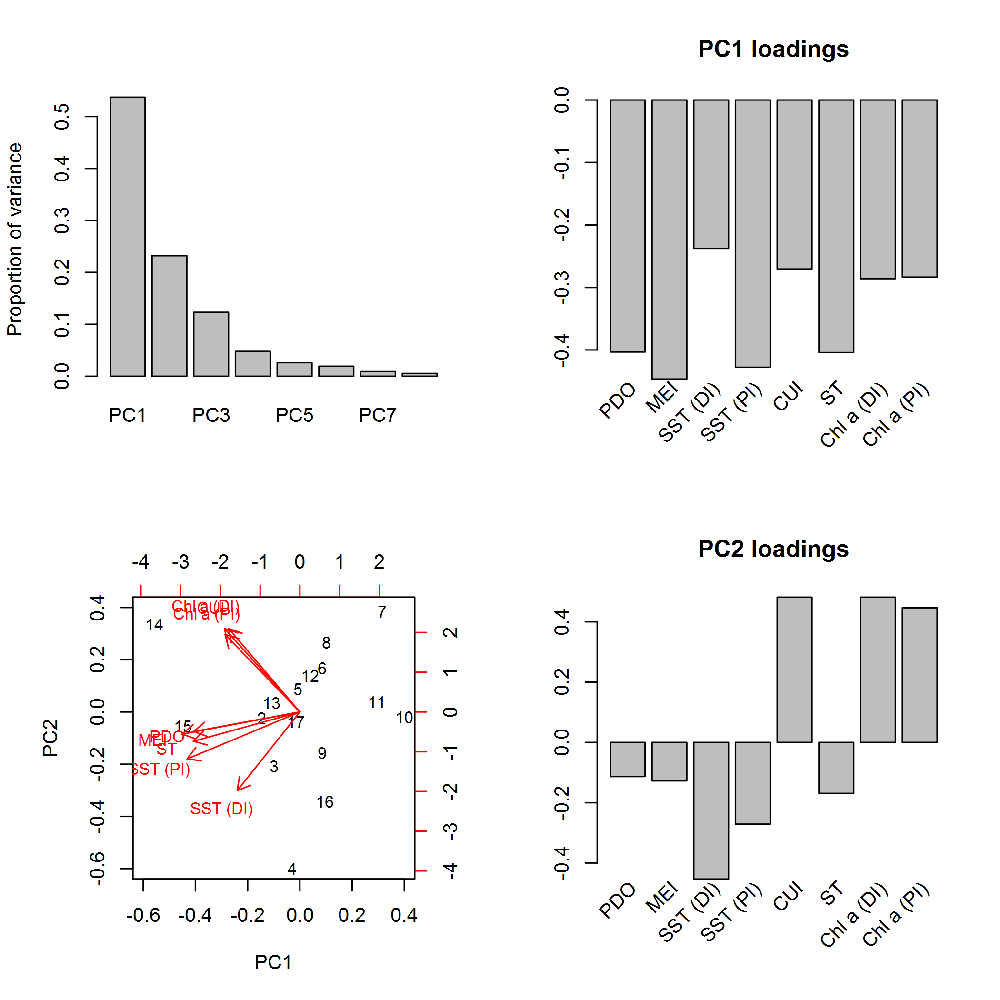

Nest Success of Two Rhinoceros Auklet Colonies in the Salish Sea and
California Current
================
Eric Wagner, Eric Buhle, …
April 21, 2019

  - [Overview](#overview)
  - [Setup and data](#setup-and-data)
  - [Principal Components Analysis of Oceanographic
    Indicators](#principal-components-analysis-of-oceanographic-indicators)
  - [GLMMs of Burrow Occupancy](#glmms-of-burrow-occupancy)

# Overview

This is a Rhinoceros Auklet from the Protection Island
colony:


\[Cap

# Setup and data

First we load the libraries and functions we’ll use.

Next we’ll read in the datasets from various sources and manipulate them
into a usable format.

# Principal Components Analysis of Oceanographic Indicators

Let’s explore the patterns of (a)synchrony among the oceanographic
indicators to see how severe the multicollinearity might be if they were
used as raw regression
inputs.


Now we perform a principal components analysis to extract the major
trends in the suite of oceanographic indicators for use as regression
inputs.

``` r
pca_env <- prcomp(~ pdo_index + mei_avg + sst_DI_spring + sst_PI_spring + 
                    cui_spring + chla_DI_spring + chla_PI_spring + st_onset, 
                  data = env_data, scale = TRUE)

pca_env            # rotation matrix gives the loadings
```

    Standard deviations (1, .., p=8):
    [1] 2.0728549 1.3624867 0.9924571 0.6192212 0.4579104 0.3927643 0.2679374 0.2067856
    
    Rotation (n x k) = (8 x 8):
                          PC1        PC2         PC3         PC4         PC5        PC6         PC7         PC8
    pdo_index      -0.4032537 -0.1131162  0.37581649 -0.31536032 -0.60799403  0.3409443 -0.15072067  0.27438037
    mei_avg        -0.4465664 -0.1275237  0.07999949 -0.22583164  0.28890643 -0.5977609  0.27744056  0.45733801
    sst_DI_spring  -0.2374015 -0.4532955 -0.56717794  0.22677323 -0.24954683 -0.2470813 -0.49144976 -0.01418353
    sst_PI_spring  -0.4277657 -0.2711304 -0.16615976  0.07713533 -0.08299182  0.1986218  0.64087140 -0.50288314
    cui_spring     -0.2704591  0.4816178  0.29890905  0.56249483 -0.31357726 -0.3900527 -0.03809154 -0.19294126
    chla_DI_spring -0.2859470  0.4816069 -0.25504438 -0.60163238  0.07664705 -0.1002367 -0.26588956 -0.41552439
    chla_PI_spring -0.2834287  0.4465721 -0.47089350  0.25744514  0.10822038  0.4240045  0.10530644  0.47920966
    st_onset       -0.4041983 -0.1691934  0.35626848  0.21801839  0.60149643  0.2897772 -0.40599671 -0.15144634

``` r
summary(pca_env)   # proportion of variance associated with each PC
```

    Importance of components:
                              PC1    PC2    PC3     PC4     PC5     PC6     PC7     PC8
    Standard deviation     2.0729 1.3625 0.9925 0.61922 0.45791 0.39276 0.26794 0.20679
    Proportion of Variance 0.5371 0.2321 0.1231 0.04793 0.02621 0.01928 0.00897 0.00535
    Cumulative Proportion  0.5371 0.7691 0.8923 0.94019 0.96640 0.98568 0.99465 1.00000

``` r
## Add PC1 and PC2 to covariate data
scores <- predict(pca_env, newdata = env_data)
env_data <- data.frame(env_data, PC1 = scale(scores[,"PC1"]), PC2 = scale(scores[,"PC2"]))

## Merge PC1 and PC2 into nest data
rhau <- left_join(nest_data, select(env_data, c(year, PC1, PC2)))
```




# GLMMs of Burrow Occupancy

Now we are ready to start fitting some GLMMs to the burrow occupancy
data…\[more on modeling, explanations of each model\]

``` r
## Random effects of site and year

# Intercept-only model 
occ0 <- stan_glmer(cbind(egg, viable - egg) ~ (1 | site) + (1 | year),
                   data =  rhau,
                   family = binomial(link = logit),
                   prior_intercept = normal(0,5),
                   prior_covariance = decov(),
                   chains = 3, iter = 2000, warmup = 1000, cores = 3)
```

``` r
summary(occ0, prob = c(0.025,0.5,0.975), digits = 2)
```

``` 

Model Info:

 function:     stan_glmer
 family:       binomial [logit]
 formula:      cbind(egg, viable - egg) ~ (1 | site) + (1 | year)
 algorithm:    sampling
 priors:       see help('prior_summary')
 sample:       3000 (posterior sample size)
 observations: 139
 groups:       site (17), year (9)

Estimates:
                                      mean    sd      2.5%    50%     97.5%
(Intercept)                            0.54    0.11    0.32    0.54    0.75
b[(Intercept) site:Boathouse]         -0.25    0.16   -0.58   -0.24    0.03
b[(Intercept) site:Catwalk.Salmon]     0.04    0.18   -0.31    0.04    0.42
b[(Intercept) site:Catwalk.Willow]    -0.30    0.18   -0.66   -0.29    0.05
b[(Intercept) site:Grassy.Knoll]      -0.09    0.19   -0.49   -0.09    0.28
b[(Intercept) site:s741]              -0.18    0.18   -0.56   -0.18    0.16
b[(Intercept) site:s742]               0.20    0.19   -0.14    0.19    0.57
b[(Intercept) site:s743]               0.22    0.19   -0.12    0.22    0.62
b[(Intercept) site:s744]              -0.02    0.18   -0.39   -0.01    0.34
b[(Intercept) site:s746]              -0.20    0.18   -0.57   -0.19    0.15
b[(Intercept) site:s747]               0.23    0.19   -0.13    0.22    0.61
b[(Intercept) site:s748]              -0.16    0.22   -0.61   -0.15    0.24
b[(Intercept) site:s749]               0.25    0.19   -0.09    0.24    0.64
b[(Intercept) site:s750]               0.32    0.20   -0.03    0.31    0.74
b[(Intercept) site:s751]               0.12    0.21   -0.27    0.11    0.55
b[(Intercept) site:Salmon.Sequel]     -0.16    0.18   -0.53   -0.15    0.18
b[(Intercept) site:SW.Point]          -0.25    0.16   -0.57   -0.24    0.05
b[(Intercept) site:Willow.Gully]       0.19    0.18   -0.14    0.18    0.55
b[(Intercept) year:2010]               0.10    0.13   -0.10    0.08    0.40
b[(Intercept) year:2011]               0.04    0.12   -0.19    0.03    0.30
b[(Intercept) year:2012]              -0.02    0.11   -0.25   -0.01    0.21
b[(Intercept) year:2013]              -0.04    0.12   -0.29   -0.02    0.19
b[(Intercept) year:2014]              -0.08    0.12   -0.35   -0.06    0.11
b[(Intercept) year:2015]              -0.04    0.12   -0.30   -0.03    0.19
b[(Intercept) year:2016]               0.16    0.14   -0.05    0.14    0.49
b[(Intercept) year:2017]              -0.09    0.12   -0.35   -0.07    0.12
b[(Intercept) year:2018]              -0.05    0.11   -0.30   -0.04    0.16
Sigma[site:(Intercept),(Intercept)]    0.09    0.06    0.02    0.08    0.24
Sigma[year:(Intercept),(Intercept)]    0.03    0.04    0.00    0.02    0.13
mean_PPD                               7.38    0.19    7.01    7.39    7.76
log-posterior                       -312.27    5.54 -323.94 -312.03 -302.44

Diagnostics:
                                    mcse Rhat n_eff
(Intercept)                         0.00 1.00 1313 
b[(Intercept) site:Boathouse]       0.00 1.00 3090 
b[(Intercept) site:Catwalk.Salmon]  0.00 1.00 3559 
b[(Intercept) site:Catwalk.Willow]  0.00 1.00 2921 
b[(Intercept) site:Grassy.Knoll]    0.00 1.00 3617 
b[(Intercept) site:s741]            0.00 1.00 3488 
b[(Intercept) site:s742]            0.00 1.00 3107 
b[(Intercept) site:s743]            0.00 1.00 2868 
b[(Intercept) site:s744]            0.00 1.00 3872 
b[(Intercept) site:s746]            0.00 1.00 3170 
b[(Intercept) site:s747]            0.00 1.00 2869 
b[(Intercept) site:s748]            0.00 1.00 3170 
b[(Intercept) site:s749]            0.00 1.00 2452 
b[(Intercept) site:s750]            0.00 1.00 2406 
b[(Intercept) site:s751]            0.00 1.00 3453 
b[(Intercept) site:Salmon.Sequel]   0.00 1.00 3116 
b[(Intercept) site:SW.Point]        0.00 1.00 2845 
b[(Intercept) site:Willow.Gully]    0.00 1.00 3065 
b[(Intercept) year:2010]            0.00 1.00 2175 
b[(Intercept) year:2011]            0.00 1.00 2386 
b[(Intercept) year:2012]            0.00 1.00 2784 
b[(Intercept) year:2013]            0.00 1.00 2258 
b[(Intercept) year:2014]            0.00 1.00 1937 
b[(Intercept) year:2015]            0.00 1.00 2405 
b[(Intercept) year:2016]            0.00 1.00 1497 
b[(Intercept) year:2017]            0.00 1.00 2083 
b[(Intercept) year:2018]            0.00 1.00 2178 
Sigma[site:(Intercept),(Intercept)] 0.00 1.00 1258 
Sigma[year:(Intercept),(Intercept)] 0.00 1.00 1295 
mean_PPD                            0.00 1.00 3401 
log-posterior                       0.21 1.00  717 

For each parameter, mcse is Monte Carlo standard error, n_eff is a crude measure of effective sample size, and Rhat is the potential scale reduction factor on split chains (at convergence Rhat=1).
```

``` r
# Inter-island differences, constant across years
occ1 <- stan_glmer(cbind(egg, viable - egg) ~ island + (1 | site) + (1 | year),
                   data =  rhau,
                   family = binomial(link = logit),
                   prior = normal(0,5),
                   prior_intercept = normal(0,5),
                   prior_covariance = decov(),
                   chains = 3, iter = 2000, warmup = 1000, cores = 3)
```

``` r
summary(occ1, prob = c(0.025,0.5,0.975), digits = 2)
```

``` 

Model Info:

 function:     stan_glmer
 family:       binomial [logit]
 formula:      cbind(egg, viable - egg) ~ island + (1 | site) + (1 | year)
 algorithm:    sampling
 priors:       see help('prior_summary')
 sample:       3000 (posterior sample size)
 observations: 139
 groups:       site (17), year (9)

Estimates:
                                      mean    sd      2.5%    50%     97.5%
(Intercept)                            0.35    0.14    0.08    0.35    0.63
islandPI                               0.32    0.17    0.00    0.32    0.64
b[(Intercept) site:Boathouse]         -0.10    0.16   -0.43   -0.09    0.20
b[(Intercept) site:Catwalk.Salmon]     0.12    0.18   -0.20    0.11    0.51
b[(Intercept) site:Catwalk.Willow]    -0.14    0.17   -0.50   -0.13    0.17
b[(Intercept) site:Grassy.Knoll]       0.00    0.18   -0.35    0.00    0.35
b[(Intercept) site:s741]              -0.21    0.17   -0.58   -0.20    0.09
b[(Intercept) site:s742]               0.10    0.17   -0.21    0.08    0.45
b[(Intercept) site:s743]               0.11    0.17   -0.19    0.10    0.51
b[(Intercept) site:s744]              -0.08    0.16   -0.43   -0.08    0.23
b[(Intercept) site:s746]              -0.22    0.19   -0.62   -0.20    0.10
b[(Intercept) site:s747]               0.12    0.17   -0.19    0.10    0.50
b[(Intercept) site:s748]              -0.17    0.21   -0.63   -0.14    0.19
b[(Intercept) site:s749]               0.14    0.18   -0.19    0.13    0.51
b[(Intercept) site:s750]               0.19    0.18   -0.12    0.17    0.59
b[(Intercept) site:s751]               0.05    0.18   -0.28    0.04    0.42
b[(Intercept) site:Salmon.Sequel]     -0.04    0.17   -0.39   -0.03    0.30
b[(Intercept) site:SW.Point]          -0.09    0.16   -0.43   -0.08    0.21
b[(Intercept) site:Willow.Gully]       0.24    0.19   -0.08    0.23    0.67
b[(Intercept) year:2010]               0.09    0.13   -0.12    0.06    0.39
b[(Intercept) year:2011]               0.04    0.12   -0.19    0.02    0.30
b[(Intercept) year:2012]              -0.02    0.11   -0.27   -0.01    0.19
b[(Intercept) year:2013]              -0.04    0.12   -0.30   -0.02    0.18
b[(Intercept) year:2014]              -0.08    0.12   -0.36   -0.06    0.11
b[(Intercept) year:2015]              -0.03    0.11   -0.28   -0.02    0.18
b[(Intercept) year:2016]               0.16    0.14   -0.04    0.14    0.50
b[(Intercept) year:2017]              -0.08    0.12   -0.37   -0.06    0.12
b[(Intercept) year:2018]              -0.05    0.11   -0.29   -0.03    0.17
Sigma[site:(Intercept),(Intercept)]    0.06    0.05    0.00    0.05    0.18
Sigma[year:(Intercept),(Intercept)]    0.03    0.04    0.00    0.02    0.12
mean_PPD                               7.38    0.20    7.00    7.38    7.76
log-posterior                       -314.40    5.96 -327.40 -314.02 -304.10

Diagnostics:
                                    mcse Rhat n_eff
(Intercept)                         0.00 1.00 1535 
islandPI                            0.00 1.00 1993 
b[(Intercept) site:Boathouse]       0.00 1.00 2145 
b[(Intercept) site:Catwalk.Salmon]  0.00 1.00 2366 
b[(Intercept) site:Catwalk.Willow]  0.00 1.00 2286 
b[(Intercept) site:Grassy.Knoll]    0.00 1.00 2954 
b[(Intercept) site:s741]            0.00 1.00 1755 
b[(Intercept) site:s742]            0.00 1.00 3073 
b[(Intercept) site:s743]            0.00 1.00 2581 
b[(Intercept) site:s744]            0.00 1.00 2653 
b[(Intercept) site:s746]            0.00 1.00 1855 
b[(Intercept) site:s747]            0.00 1.00 2367 
b[(Intercept) site:s748]            0.00 1.00 2351 
b[(Intercept) site:s749]            0.00 1.00 2510 
b[(Intercept) site:s750]            0.00 1.00 1853 
b[(Intercept) site:s751]            0.00 1.00 3177 
b[(Intercept) site:Salmon.Sequel]   0.00 1.00 3017 
b[(Intercept) site:SW.Point]        0.00 1.00 2315 
b[(Intercept) site:Willow.Gully]    0.00 1.00 1719 
b[(Intercept) year:2010]            0.00 1.00 2280 
b[(Intercept) year:2011]            0.00 1.00 3203 
b[(Intercept) year:2012]            0.00 1.00 2842 
b[(Intercept) year:2013]            0.00 1.00 2839 
b[(Intercept) year:2014]            0.00 1.00 1725 
b[(Intercept) year:2015]            0.00 1.00 3083 
b[(Intercept) year:2016]            0.00 1.00 1569 
b[(Intercept) year:2017]            0.00 1.00 1901 
b[(Intercept) year:2018]            0.00 1.00 2742 
Sigma[site:(Intercept),(Intercept)] 0.00 1.00  925 
Sigma[year:(Intercept),(Intercept)] 0.00 1.00 1013 
mean_PPD                            0.00 1.00 3357 
log-posterior                       0.25 1.01  548 

For each parameter, mcse is Monte Carlo standard error, n_eff is a crude measure of effective sample size, and Rhat is the potential scale reduction factor on split chains (at convergence Rhat=1).
```

``` r
# Inter-island differences, varying among years
occ2 <- stan_glmer(cbind(egg, viable - egg) ~ island + (1 | site) + (island | year),
                   data =  rhau,
                   family = binomial(link = logit),
                   prior = normal(0,5),
                   prior_intercept = normal(0,5),
                   prior_covariance = decov(),
                   chains = 3, iter = 2000, warmup = 1000, cores = 3)
```

``` r
summary(occ2, prob = c(0.025,0.5,0.975), digits = 2)
```

``` 

Model Info:

 function:     stan_glmer
 family:       binomial [logit]
 formula:      cbind(egg, viable - egg) ~ island + (1 | site) + (island | year)
 algorithm:    sampling
 priors:       see help('prior_summary')
 sample:       3000 (posterior sample size)
 observations: 139
 groups:       site (17), year (9)

Estimates:
                                      mean    sd      2.5%    50%     97.5%
(Intercept)                            0.35    0.13    0.09    0.35    0.61
islandPI                               0.33    0.18   -0.02    0.33    0.69
b[(Intercept) site:Boathouse]         -0.10    0.15   -0.43   -0.09    0.18
b[(Intercept) site:Catwalk.Salmon]     0.12    0.18   -0.19    0.11    0.51
b[(Intercept) site:Catwalk.Willow]    -0.14    0.17   -0.50   -0.13    0.16
b[(Intercept) site:Grassy.Knoll]      -0.01    0.18   -0.39    0.00    0.33
b[(Intercept) site:s741]              -0.22    0.18   -0.62   -0.21    0.09
b[(Intercept) site:s742]               0.09    0.17   -0.21    0.08    0.45
b[(Intercept) site:s743]               0.11    0.17   -0.20    0.10    0.47
b[(Intercept) site:s744]              -0.08    0.16   -0.43   -0.07    0.23
b[(Intercept) site:s746]              -0.23    0.19   -0.62   -0.21    0.09
b[(Intercept) site:s747]               0.12    0.18   -0.20    0.11    0.49
b[(Intercept) site:s748]              -0.17    0.21   -0.64   -0.15    0.17
b[(Intercept) site:s749]               0.13    0.17   -0.18    0.12    0.49
b[(Intercept) site:s750]               0.19    0.18   -0.12    0.17    0.59
b[(Intercept) site:s751]               0.04    0.18   -0.30    0.03    0.42
b[(Intercept) site:Salmon.Sequel]     -0.04    0.18   -0.41   -0.03    0.29
b[(Intercept) site:SW.Point]          -0.09    0.16   -0.43   -0.08    0.19
b[(Intercept) site:Willow.Gully]       0.24    0.18   -0.06    0.23    0.63
b[(Intercept) year:2010]               0.07    0.13   -0.14    0.05    0.36
b[islandPI year:2010]                  0.05    0.18   -0.30    0.03    0.47
b[(Intercept) year:2011]               0.03    0.12   -0.19    0.02    0.30
b[islandPI year:2011]                  0.01    0.16   -0.36    0.01    0.37
b[(Intercept) year:2012]              -0.03    0.11   -0.28   -0.02    0.19
b[islandPI year:2012]                  0.03    0.16   -0.30    0.01    0.40
b[(Intercept) year:2013]               0.01    0.13   -0.22    0.00    0.31
b[islandPI year:2013]                 -0.14    0.20   -0.64   -0.09    0.14
b[(Intercept) year:2014]              -0.10    0.15   -0.46   -0.07    0.10
b[islandPI year:2014]                  0.08    0.19   -0.23    0.04    0.55
b[(Intercept) year:2015]              -0.07    0.13   -0.37   -0.04    0.14
b[islandPI year:2015]                  0.12    0.19   -0.17    0.08    0.61
b[(Intercept) year:2016]               0.11    0.14   -0.11    0.09    0.43
b[islandPI year:2016]                  0.13    0.19   -0.20    0.09    0.58
b[(Intercept) year:2017]              -0.03    0.12   -0.28   -0.02    0.23
b[islandPI year:2017]                 -0.16    0.20   -0.64   -0.12    0.12
b[(Intercept) year:2018]               0.00    0.12   -0.24    0.00    0.26
b[islandPI year:2018]                 -0.14    0.19   -0.59   -0.10    0.14
Sigma[site:(Intercept),(Intercept)]    0.06    0.05    0.00    0.05    0.19
Sigma[year:(Intercept),(Intercept)]    0.03    0.04    0.00    0.02    0.13
Sigma[year:islandPI,(Intercept)]      -0.01    0.03   -0.09    0.00    0.03
Sigma[year:islandPI,islandPI]          0.06    0.08    0.00    0.03    0.25
mean_PPD                               7.38    0.19    6.99    7.38    7.75
log-posterior                       -330.92    6.74 -344.97 -330.52 -318.70

Diagnostics:
                                    mcse Rhat n_eff
(Intercept)                         0.00 1.00 2421 
islandPI                            0.00 1.00 2213 
b[(Intercept) site:Boathouse]       0.00 1.00 3250 
b[(Intercept) site:Catwalk.Salmon]  0.00 1.00 3202 
b[(Intercept) site:Catwalk.Willow]  0.00 1.00 3440 
b[(Intercept) site:Grassy.Knoll]    0.00 1.00 4622 
b[(Intercept) site:s741]            0.00 1.00 2301 
b[(Intercept) site:s742]            0.00 1.00 3250 
b[(Intercept) site:s743]            0.00 1.00 3821 
b[(Intercept) site:s744]            0.00 1.00 3432 
b[(Intercept) site:s746]            0.00 1.00 2250 
b[(Intercept) site:s747]            0.00 1.00 3678 
b[(Intercept) site:s748]            0.00 1.00 2889 
b[(Intercept) site:s749]            0.00 1.00 3344 
b[(Intercept) site:s750]            0.00 1.00 2619 
b[(Intercept) site:s751]            0.00 1.00 6069 
b[(Intercept) site:Salmon.Sequel]   0.00 1.00 3827 
b[(Intercept) site:SW.Point]        0.00 1.00 3183 
b[(Intercept) site:Willow.Gully]    0.00 1.00 1797 
b[(Intercept) year:2010]            0.00 1.00 3111 
b[islandPI year:2010]               0.00 1.00 3270 
b[(Intercept) year:2011]            0.00 1.00 3620 
b[islandPI year:2011]               0.00 1.00 3282 
b[(Intercept) year:2012]            0.00 1.00 3468 
b[islandPI year:2012]               0.00 1.00 3497 
b[(Intercept) year:2013]            0.00 1.00 3145 
b[islandPI year:2013]               0.00 1.00 1850 
b[(Intercept) year:2014]            0.00 1.00 2121 
b[islandPI year:2014]               0.00 1.00 2302 
b[(Intercept) year:2015]            0.00 1.00 2624 
b[islandPI year:2015]               0.00 1.00 2009 
b[(Intercept) year:2016]            0.00 1.00 2257 
b[islandPI year:2016]               0.00 1.00 2546 
b[(Intercept) year:2017]            0.00 1.00 2585 
b[islandPI year:2017]               0.00 1.00 1726 
b[(Intercept) year:2018]            0.00 1.00 2924 
b[islandPI year:2018]               0.00 1.00 1977 
Sigma[site:(Intercept),(Intercept)] 0.00 1.00 1162 
Sigma[year:(Intercept),(Intercept)] 0.00 1.00 1424 
Sigma[year:islandPI,(Intercept)]    0.00 1.00 1865 
Sigma[year:islandPI,islandPI]       0.00 1.00 1313 
mean_PPD                            0.00 1.00 3110 
log-posterior                       0.27 1.00  639 

For each parameter, mcse is Monte Carlo standard error, n_eff is a crude measure of effective sample size, and Rhat is the potential scale reduction factor on split chains (at convergence Rhat=1).
```

``` r
# Inter-island differences, varying among years, plus PC1 + PC2
occ3 <- stan_glmer(cbind(egg, viable - egg) ~ island + PC1 + PC2 + (1 | site) + (island | year),
                   data =  rhau,
                   family = binomial(link = logit),
                   prior = normal(0,5),
                   prior_intercept = normal(0,5),
                   prior_covariance = decov(),
                   chains = 3, iter = 2000, warmup = 1000, cores = 3)
```

``` r
summary(occ3, prob = c(0.025,0.5,0.975), digits = 2)
```

``` 

Model Info:

 function:     stan_glmer
 family:       binomial [logit]
 formula:      cbind(egg, viable - egg) ~ island + PC1 + PC2 + (1 | site) + 
       (island | year)
 algorithm:    sampling
 priors:       see help('prior_summary')
 sample:       3000 (posterior sample size)
 observations: 139
 groups:       site (17), year (9)

Estimates:
                                      mean    sd      2.5%    50%     97.5%
(Intercept)                            0.34    0.14    0.07    0.34    0.61
islandPI                               0.33    0.18   -0.02    0.33    0.69
PC1                                   -0.03    0.08   -0.19   -0.04    0.14
PC2                                   -0.10    0.15   -0.39   -0.09    0.17
b[(Intercept) site:Boathouse]         -0.10    0.16   -0.43   -0.09    0.18
b[(Intercept) site:Catwalk.Salmon]     0.12    0.17   -0.19    0.11    0.50
b[(Intercept) site:Catwalk.Willow]    -0.14    0.17   -0.52   -0.13    0.16
b[(Intercept) site:Grassy.Knoll]      -0.01    0.18   -0.37   -0.01    0.36
b[(Intercept) site:s741]              -0.22    0.18   -0.61   -0.20    0.09
b[(Intercept) site:s742]               0.09    0.17   -0.23    0.08    0.45
b[(Intercept) site:s743]               0.11    0.17   -0.21    0.10    0.47
b[(Intercept) site:s744]              -0.08    0.17   -0.44   -0.07    0.23
b[(Intercept) site:s746]              -0.23    0.19   -0.65   -0.21    0.08
b[(Intercept) site:s747]               0.12    0.17   -0.19    0.10    0.48
b[(Intercept) site:s748]              -0.16    0.21   -0.62   -0.14    0.20
b[(Intercept) site:s749]               0.14    0.18   -0.19    0.12    0.52
b[(Intercept) site:s750]               0.19    0.18   -0.12    0.17    0.60
b[(Intercept) site:s751]               0.04    0.18   -0.31    0.03    0.43
b[(Intercept) site:Salmon.Sequel]     -0.04    0.17   -0.38   -0.03    0.30
b[(Intercept) site:SW.Point]          -0.09    0.15   -0.41   -0.08    0.19
b[(Intercept) site:Willow.Gully]       0.24    0.19   -0.07    0.23    0.63
b[(Intercept) year:2010]               0.07    0.14   -0.20    0.04    0.38
b[islandPI year:2010]                  0.05    0.18   -0.31    0.03    0.45
b[(Intercept) year:2011]               0.06    0.16   -0.23    0.03    0.45
b[islandPI year:2011]                  0.01    0.19   -0.40    0.01    0.41
b[(Intercept) year:2012]              -0.01    0.15   -0.35    0.00    0.30
b[islandPI year:2012]                  0.04    0.18   -0.32    0.02    0.43
b[(Intercept) year:2013]               0.03    0.15   -0.23    0.02    0.40
b[islandPI year:2013]                 -0.13    0.20   -0.65   -0.09    0.19
b[(Intercept) year:2014]              -0.12    0.16   -0.50   -0.08    0.12
b[islandPI year:2014]                  0.09    0.20   -0.26    0.05    0.58
b[(Intercept) year:2015]              -0.04    0.20   -0.49   -0.02    0.32
b[islandPI year:2015]                  0.16    0.22   -0.16    0.11    0.67
b[(Intercept) year:2016]               0.11    0.16   -0.17    0.08    0.48
b[islandPI year:2016]                  0.14    0.20   -0.21    0.10    0.62
b[(Intercept) year:2017]              -0.09    0.18   -0.51   -0.06    0.23
b[islandPI year:2017]                 -0.22    0.22   -0.74   -0.18    0.12
b[(Intercept) year:2018]              -0.01    0.13   -0.27   -0.01    0.29
b[islandPI year:2018]                 -0.16    0.21   -0.65   -0.12    0.14
Sigma[site:(Intercept),(Intercept)]    0.06    0.05    0.00    0.05    0.18
Sigma[year:(Intercept),(Intercept)]    0.04    0.07    0.00    0.02    0.18
Sigma[year:islandPI,(Intercept)]      -0.01    0.04   -0.10    0.00    0.05
Sigma[year:islandPI,islandPI]          0.07    0.09    0.00    0.04    0.30
mean_PPD                               7.38    0.20    6.99    7.39    7.77
log-posterior                       -332.58    6.76 -346.85 -332.41 -320.46

Diagnostics:
                                    mcse Rhat n_eff
(Intercept)                         0.00 1.00 1891 
islandPI                            0.00 1.00 2529 
PC1                                 0.00 1.00 2435 
PC2                                 0.00 1.00 1052 
b[(Intercept) site:Boathouse]       0.00 1.00 2334 
b[(Intercept) site:Catwalk.Salmon]  0.00 1.00 3067 
b[(Intercept) site:Catwalk.Willow]  0.00 1.00 2850 
b[(Intercept) site:Grassy.Knoll]    0.00 1.00 4558 
b[(Intercept) site:s741]            0.00 1.00 2364 
b[(Intercept) site:s742]            0.00 1.00 3910 
b[(Intercept) site:s743]            0.00 1.00 3851 
b[(Intercept) site:s744]            0.00 1.00 3830 
b[(Intercept) site:s746]            0.00 1.00 2315 
b[(Intercept) site:s747]            0.00 1.00 3787 
b[(Intercept) site:s748]            0.00 1.00 3061 
b[(Intercept) site:s749]            0.00 1.00 3213 
b[(Intercept) site:s750]            0.00 1.00 2350 
b[(Intercept) site:s751]            0.00 1.00 4666 
b[(Intercept) site:Salmon.Sequel]   0.00 1.00 2934 
b[(Intercept) site:SW.Point]        0.00 1.00 2444 
b[(Intercept) site:Willow.Gully]    0.00 1.00 1841 
b[(Intercept) year:2010]            0.00 1.00 2639 
b[islandPI year:2010]               0.00 1.00 3428 
b[(Intercept) year:2011]            0.00 1.00 2234 
b[islandPI year:2011]               0.00 1.00 3703 
b[(Intercept) year:2012]            0.00 1.00 2033 
b[islandPI year:2012]               0.00 1.00 3127 
b[(Intercept) year:2013]            0.00 1.00 1828 
b[islandPI year:2013]               0.00 1.00 2155 
b[(Intercept) year:2014]            0.00 1.00 2005 
b[islandPI year:2014]               0.00 1.00 2213 
b[(Intercept) year:2015]            0.01 1.00 1436 
b[islandPI year:2015]               0.01 1.00 1886 
b[(Intercept) year:2016]            0.00 1.00 2067 
b[islandPI year:2016]               0.00 1.00 2927 
b[(Intercept) year:2017]            0.00 1.00 1371 
b[islandPI year:2017]               0.01 1.00 1419 
b[(Intercept) year:2018]            0.00 1.00 2613 
b[islandPI year:2018]               0.01 1.00 1645 
Sigma[site:(Intercept),(Intercept)] 0.00 1.00 1198 
Sigma[year:(Intercept),(Intercept)] 0.00 1.00  608 
Sigma[year:islandPI,(Intercept)]    0.00 1.00 1433 
Sigma[year:islandPI,islandPI]       0.00 1.00 1148 
mean_PPD                            0.00 1.00 2922 
log-posterior                       0.29 1.00  533 

For each parameter, mcse is Monte Carlo standard error, n_eff is a crude measure of effective sample size, and Rhat is the potential scale reduction factor on split chains (at convergence Rhat=1).
```

``` r
# Inter-island differences plus PC1 + PC2, no random time-variation
occ4 <- stan_glmer(cbind(egg, viable - egg) ~ island + PC1 + PC2 + (1 | site),
                   data =  rhau,
                   family = binomial(link = logit),
                   prior = normal(0,5),
                   prior_intercept = normal(0,5),
                   prior_covariance = decov(),
                   chains = 3, iter = 2000, warmup = 1000, cores = 3)
```

``` r
summary(occ4, prob = c(0.025,0.5,0.975), digits = 2)
```

``` 

Model Info:

 function:     stan_glmer
 family:       binomial [logit]
 formula:      cbind(egg, viable - egg) ~ island + PC1 + PC2 + (1 | site)
 algorithm:    sampling
 priors:       see help('prior_summary')
 sample:       3000 (posterior sample size)
 observations: 139
 groups:       site (17)

Estimates:
                                      mean    sd      2.5%    50%     97.5%
(Intercept)                            0.33    0.12    0.09    0.33    0.55
islandPI                               0.33    0.15    0.02    0.33    0.64
PC1                                   -0.05    0.05   -0.15   -0.05    0.04
PC2                                   -0.06    0.08   -0.23   -0.06    0.09
b[(Intercept) site:Boathouse]         -0.09    0.15   -0.41   -0.07    0.19
b[(Intercept) site:Catwalk.Salmon]     0.12    0.17   -0.19    0.11    0.51
b[(Intercept) site:Catwalk.Willow]    -0.12    0.16   -0.47   -0.11    0.17
b[(Intercept) site:Grassy.Knoll]      -0.01    0.16   -0.34    0.00    0.33
b[(Intercept) site:s741]              -0.20    0.18   -0.58   -0.19    0.10
b[(Intercept) site:s742]               0.09    0.16   -0.22    0.07    0.44
b[(Intercept) site:s743]               0.11    0.16   -0.19    0.10    0.46
b[(Intercept) site:s744]              -0.08    0.16   -0.42   -0.06    0.23
b[(Intercept) site:s746]              -0.21    0.18   -0.60   -0.20    0.09
b[(Intercept) site:s747]               0.11    0.16   -0.18    0.09    0.46
b[(Intercept) site:s748]              -0.13    0.19   -0.57   -0.11    0.20
b[(Intercept) site:s749]               0.12    0.17   -0.17    0.11    0.48
b[(Intercept) site:s750]               0.18    0.18   -0.12    0.17    0.57
b[(Intercept) site:s751]               0.02    0.18   -0.33    0.02    0.40
b[(Intercept) site:Salmon.Sequel]     -0.03    0.17   -0.38   -0.03    0.29
b[(Intercept) site:SW.Point]          -0.08    0.15   -0.39   -0.07    0.20
b[(Intercept) site:Willow.Gully]       0.23    0.18   -0.06    0.22    0.64
Sigma[site:(Intercept),(Intercept)]    0.05    0.04    0.00    0.04    0.17
mean_PPD                               7.38    0.20    6.99    7.38    7.76
log-posterior                       -303.21    4.94 -313.68 -302.79 -294.85

Diagnostics:
                                    mcse Rhat n_eff
(Intercept)                         0.00 1.00 1978 
islandPI                            0.00 1.00 1910 
PC1                                 0.00 1.00 3632 
PC2                                 0.00 1.00 3693 
b[(Intercept) site:Boathouse]       0.00 1.00 2514 
b[(Intercept) site:Catwalk.Salmon]  0.00 1.00 2595 
b[(Intercept) site:Catwalk.Willow]  0.00 1.00 2325 
b[(Intercept) site:Grassy.Knoll]    0.00 1.00 3815 
b[(Intercept) site:s741]            0.00 1.00 1767 
b[(Intercept) site:s742]            0.00 1.00 3045 
b[(Intercept) site:s743]            0.00 1.00 2858 
b[(Intercept) site:s744]            0.00 1.00 3334 
b[(Intercept) site:s746]            0.00 1.00 1650 
b[(Intercept) site:s747]            0.00 1.00 2751 
b[(Intercept) site:s748]            0.00 1.00 2618 
b[(Intercept) site:s749]            0.00 1.00 2484 
b[(Intercept) site:s750]            0.00 1.00 2300 
b[(Intercept) site:s751]            0.00 1.00 3293 
b[(Intercept) site:Salmon.Sequel]   0.00 1.00 3175 
b[(Intercept) site:SW.Point]        0.00 1.00 2613 
b[(Intercept) site:Willow.Gully]    0.00 1.00 1396 
Sigma[site:(Intercept),(Intercept)] 0.00 1.00  825 
mean_PPD                            0.00 1.00 3600 
log-posterior                       0.22 1.01  482 

For each parameter, mcse is Monte Carlo standard error, n_eff is a crude measure of effective sample size, and Rhat is the potential scale reduction factor on split chains (at convergence Rhat=1).
```

We compare the expected out-of-sample predictive performance of the
candidate models using the Bayesian Pareto-smoothed approxiamte
leave-one-out cross-validation score…

``` r
## Model selection by approximate leave-one-out cross-validation
occ_loos <-  lapply(list(occ0 = occ0, occ1 = occ1, occ2 = occ2, occ3 = occ3, occ4 = occ4), loo)

# unpaired comparisons
occ_compare <- loo_compare(occ_loos)

# pairwise comparisons
occ_compair <- loo_compair(occ_loos)
```

``` r
occ_loos
```

    $occ0
    
    Computed from 3000 by 139 log-likelihood matrix
    
             Estimate   SE
    elpd_loo   -275.7  8.0
    p_loo        15.9  1.7
    looic       551.4 16.0
    ------
    Monte Carlo SE of elpd_loo is 0.1.
    
    Pareto k diagnostic values:
                             Count Pct.    Min. n_eff
    (-Inf, 0.5]   (good)     138   99.3%   1133      
     (0.5, 0.7]   (ok)         1    0.7%   958       
       (0.7, 1]   (bad)        0    0.0%   <NA>      
       (1, Inf)   (very bad)   0    0.0%   <NA>      
    
    All Pareto k estimates are ok (k < 0.7).
    See help('pareto-k-diagnostic') for details.
    
    $occ1
    
    Computed from 3000 by 139 log-likelihood matrix
    
             Estimate   SE
    elpd_loo   -275.9  7.9
    p_loo        15.0  1.6
    looic       551.8 15.9
    ------
    Monte Carlo SE of elpd_loo is 0.1.
    
    All Pareto k estimates are good (k < 0.5).
    See help('pareto-k-diagnostic') for details.
    
    $occ2
    
    Computed from 3000 by 139 log-likelihood matrix
    
             Estimate   SE
    elpd_loo   -274.8  7.8
    p_loo        17.0  1.8
    looic       549.5 15.5
    ------
    Monte Carlo SE of elpd_loo is 0.1.
    
    Pareto k diagnostic values:
                             Count Pct.    Min. n_eff
    (-Inf, 0.5]   (good)     136   97.8%   1072      
     (0.5, 0.7]   (ok)         3    2.2%   423       
       (0.7, 1]   (bad)        0    0.0%   <NA>      
       (1, Inf)   (very bad)   0    0.0%   <NA>      
    
    All Pareto k estimates are ok (k < 0.7).
    See help('pareto-k-diagnostic') for details.
    
    $occ3
    
    Computed from 3000 by 139 log-likelihood matrix
    
             Estimate   SE
    elpd_loo   -275.9  7.9
    p_loo        19.0  2.0
    looic       551.8 15.7
    ------
    Monte Carlo SE of elpd_loo is 0.1.
    
    Pareto k diagnostic values:
                             Count Pct.    Min. n_eff
    (-Inf, 0.5]   (good)     135   97.1%   968       
     (0.5, 0.7]   (ok)         4    2.9%   357       
       (0.7, 1]   (bad)        0    0.0%   <NA>      
       (1, Inf)   (very bad)   0    0.0%   <NA>      
    
    All Pareto k estimates are ok (k < 0.7).
    See help('pareto-k-diagnostic') for details.
    
    $occ4
    
    Computed from 3000 by 139 log-likelihood matrix
    
             Estimate   SE
    elpd_loo   -277.8  8.1
    p_loo        13.0  1.4
    looic       555.6 16.2
    ------
    Monte Carlo SE of elpd_loo is 0.1.
    
    Pareto k diagnostic values:
                             Count Pct.    Min. n_eff
    (-Inf, 0.5]   (good)     138   99.3%   1054      
     (0.5, 0.7]   (ok)         1    0.7%   732       
       (0.7, 1]   (bad)        0    0.0%   <NA>      
       (1, Inf)   (very bad)   0    0.0%   <NA>      
    
    All Pareto k estimates are ok (k < 0.7).
    See help('pareto-k-diagnostic') for details.

``` r
print(occ_compare, simplify = FALSE)
```

``` 
     elpd_diff se_diff elpd_loo se_elpd_loo p_loo  se_p_loo looic  se_looic
occ2    0.0       0.0  -274.8      7.8        17.0    1.8    549.5   15.5  
occ0   -0.9       2.1  -275.7      8.0        15.9    1.7    551.4   16.0  
occ1   -1.1       1.3  -275.9      7.9        15.0    1.6    551.8   15.9  
occ3   -1.2       0.8  -275.9      7.9        19.0    2.0    551.8   15.7  
occ4   -3.1       2.2  -277.8      8.1        13.0    1.4    555.6   16.2  
```

``` r
occ_compair
```

    $`occ0 vs. occ2`
    looic_diff         se 
           1.9        4.3 
    
    $`occ1 vs. occ0`
    looic_diff         se 
           0.4        3.3 
    
    $`occ3 vs. occ1`
    looic_diff         se 
           0.1        3.3 
    
    $`occ4 vs. occ3`
    looic_diff         se 
           3.8        4.9 

If we have refit the models, we cache the results to save time…

``` r
## Cache stanfits and loo objects
save(list = grep("occ", ls(), value = TRUE), file = here::here("analysis","cache","occ_stanfit_loo.RData"))
```
