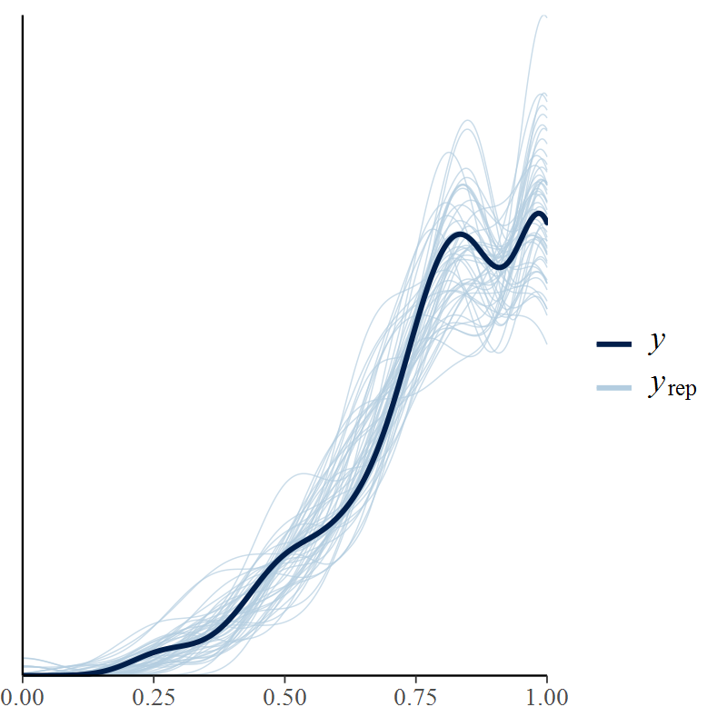

Reproductive Success of Two Rhinoceros Auklet Colonies in the Salish Sea
and California Current
================
Eric Wagner, Eric Buhle, …
April 21, 2019

  - [Overview](#overview)
  - [Setup and data](#setup-and-data)
  - [Principal Components Analysis of Oceanographic
    Indicators](#principal-components-analysis-of-oceanographic-indicators)
  - [GLMMs of Burrow Occupancy](#glmms-of-burrow-occupancy)
      - [Model Fitting and Assessment](#model-fitting-and-assessment)
      - [Model Selection](#model-selection)
      - [Plots](#plots)
  - [GLMMs of Apparent Fledging
    Success](#glmms-of-apparent-fledging-success)
      - [Model Fitting and Assessment](#model-fitting-and-assessment-1)
      - [Model Selection](#model-selection-1)
      - [Plots](#plots-1)

# Overview

This is a Rhinoceros Auklet from the Protection Island
colony:


\[Cap’n: Add elegant prose about the study system, questions, and brief
methods here; add subsections if desired\]

# Setup and data

First we load the libraries and functions we’ll use.

Next we’ll read in the datasets from various sources and manipulate them
into a usable format.

Let’s take a look at the nest data…

<table>

<thead>

<tr>

<th style="text-align:right;">

year

</th>

<th style="text-align:left;">

island

</th>

<th style="text-align:left;">

site

</th>

<th style="text-align:right;">

viable

</th>

<th style="text-align:right;">

occupied

</th>

<th style="text-align:right;">

egg

</th>

<th style="text-align:right;">

hatch

</th>

<th style="text-align:right;">

last\_check

</th>

</tr>

</thead>

<tbody>

<tr>

<td style="text-align:right;">

2010

</td>

<td style="text-align:left;">

DI

</td>

<td style="text-align:left;">

Boathouse

</td>

<td style="text-align:right;">

22

</td>

<td style="text-align:right;">

15

</td>

<td style="text-align:right;">

15

</td>

<td style="text-align:right;">

13

</td>

<td style="text-align:right;">

10

</td>

</tr>

<tr>

<td style="text-align:right;">

2010

</td>

<td style="text-align:left;">

DI

</td>

<td style="text-align:left;">

Catwalk.Salmon

</td>

<td style="text-align:right;">

13

</td>

<td style="text-align:right;">

7

</td>

<td style="text-align:right;">

5

</td>

<td style="text-align:right;">

5

</td>

<td style="text-align:right;">

4

</td>

</tr>

<tr>

<td style="text-align:right;">

2010

</td>

<td style="text-align:left;">

DI

</td>

<td style="text-align:left;">

Catwalk.Willow

</td>

<td style="text-align:right;">

13

</td>

<td style="text-align:right;">

8

</td>

<td style="text-align:right;">

8

</td>

<td style="text-align:right;">

8

</td>

<td style="text-align:right;">

8

</td>

</tr>

<tr>

<td style="text-align:right;">

2010

</td>

<td style="text-align:left;">

DI

</td>

<td style="text-align:left;">

Salmon.Sequel

</td>

<td style="text-align:right;">

11

</td>

<td style="text-align:right;">

7

</td>

<td style="text-align:right;">

7

</td>

<td style="text-align:right;">

5

</td>

<td style="text-align:right;">

3

</td>

</tr>

<tr>

<td style="text-align:right;">

2010

</td>

<td style="text-align:left;">

DI

</td>

<td style="text-align:left;">

SW.Point

</td>

<td style="text-align:right;">

14

</td>

<td style="text-align:right;">

10

</td>

<td style="text-align:right;">

8

</td>

<td style="text-align:right;">

8

</td>

<td style="text-align:right;">

7

</td>

</tr>

<tr>

<td style="text-align:right;">

2010

</td>

<td style="text-align:left;">

DI

</td>

<td style="text-align:left;">

Willow.Gully

</td>

<td style="text-align:right;">

11

</td>

<td style="text-align:right;">

10

</td>

<td style="text-align:right;">

10

</td>

<td style="text-align:right;">

10

</td>

<td style="text-align:right;">

10

</td>

</tr>

</tbody>

</table>

And here are the environmental covariates (describe oceanographic
indicators)…

<table>

<thead>

<tr>

<th style="text-align:right;">

year

</th>

<th style="text-align:right;">

pdo\_index

</th>

<th style="text-align:right;">

mei\_avg

</th>

<th style="text-align:right;">

sst\_DI\_spring

</th>

<th style="text-align:right;">

sst\_PI\_spring

</th>

<th style="text-align:right;">

sst\_amph\_spring

</th>

<th style="text-align:right;">

sst\_race\_spring

</th>

<th style="text-align:right;">

cui\_spring

</th>

<th style="text-align:right;">

chla\_DI\_spring

</th>

<th style="text-align:right;">

chla\_PI\_spring

</th>

<th style="text-align:right;">

st\_onset

</th>

<th style="text-align:right;">

st\_duration

</th>

</tr>

</thead>

<tbody>

<tr>

<td style="text-align:right;">

2002

</td>

<td style="text-align:right;">

\-0.90

</td>

<td style="text-align:right;">

0.11

</td>

<td style="text-align:right;">

NA

</td>

<td style="text-align:right;">

NA

</td>

<td style="text-align:right;">

10.36

</td>

<td style="text-align:right;">

9.60

</td>

<td style="text-align:right;">

12.33

</td>

<td style="text-align:right;">

NA

</td>

<td style="text-align:right;">

NA

</td>

<td style="text-align:right;">

108

</td>

<td style="text-align:right;">

197

</td>

</tr>

<tr>

<td style="text-align:right;">

2003

</td>

<td style="text-align:right;">

1.06

</td>

<td style="text-align:right;">

0.32

</td>

<td style="text-align:right;">

12.11

</td>

<td style="text-align:right;">

10.35

</td>

<td style="text-align:right;">

10.90

</td>

<td style="text-align:right;">

10.08

</td>

<td style="text-align:right;">

10.33

</td>

<td style="text-align:right;">

8.76

</td>

<td style="text-align:right;">

4.56

</td>

<td style="text-align:right;">

156

</td>

<td style="text-align:right;">

113

</td>

</tr>

<tr>

<td style="text-align:right;">

2004

</td>

<td style="text-align:right;">

\-0.28

</td>

<td style="text-align:right;">

0.08

</td>

<td style="text-align:right;">

13.38

</td>

<td style="text-align:right;">

10.59

</td>

<td style="text-align:right;">

11.45

</td>

<td style="text-align:right;">

10.22

</td>

<td style="text-align:right;">

11.00

</td>

<td style="text-align:right;">

5.49

</td>

<td style="text-align:right;">

5.35

</td>

<td style="text-align:right;">

146

</td>

<td style="text-align:right;">

142

</td>

</tr>

<tr>

<td style="text-align:right;">

2005

</td>

<td style="text-align:right;">

\-0.20

</td>

<td style="text-align:right;">

0.27

</td>

<td style="text-align:right;">

13.32

</td>

<td style="text-align:right;">

10.64

</td>

<td style="text-align:right;">

11.74

</td>

<td style="text-align:right;">

10.47

</td>

<td style="text-align:right;">

\-0.33

</td>

<td style="text-align:right;">

2.70

</td>

<td style="text-align:right;">

3.43

</td>

<td style="text-align:right;">

238

</td>

<td style="text-align:right;">

33

</td>

</tr>

<tr>

<td style="text-align:right;">

2006

</td>

<td style="text-align:right;">

\-0.16

</td>

<td style="text-align:right;">

\-0.35

</td>

<td style="text-align:right;">

11.81

</td>

<td style="text-align:right;">

10.22

</td>

<td style="text-align:right;">

11.03

</td>

<td style="text-align:right;">

9.90

</td>

<td style="text-align:right;">

16.67

</td>

<td style="text-align:right;">

7.01

</td>

<td style="text-align:right;">

4.82

</td>

<td style="text-align:right;">

158

</td>

<td style="text-align:right;">

146

</td>

</tr>

<tr>

<td style="text-align:right;">

2007

</td>

<td style="text-align:right;">

\-0.42

</td>

<td style="text-align:right;">

\-0.12

</td>

<td style="text-align:right;">

11.83

</td>

<td style="text-align:right;">

9.46

</td>

<td style="text-align:right;">

10.26

</td>

<td style="text-align:right;">

9.72

</td>

<td style="text-align:right;">

10.67

</td>

<td style="text-align:right;">

8.67

</td>

<td style="text-align:right;">

4.78

</td>

<td style="text-align:right;">

81

</td>

<td style="text-align:right;">

263

</td>

</tr>

<tr>

<td style="text-align:right;">

2008

</td>

<td style="text-align:right;">

\-1.05

</td>

<td style="text-align:right;">

\-1.11

</td>

<td style="text-align:right;">

10.88

</td>

<td style="text-align:right;">

8.71

</td>

<td style="text-align:right;">

10.34

</td>

<td style="text-align:right;">

9.07

</td>

<td style="text-align:right;">

17.33

</td>

<td style="text-align:right;">

6.53

</td>

<td style="text-align:right;">

4.84

</td>

<td style="text-align:right;">

64

</td>

<td style="text-align:right;">

237

</td>

</tr>

<tr>

<td style="text-align:right;">

2009

</td>

<td style="text-align:right;">

\-1.40

</td>

<td style="text-align:right;">

\-0.51

</td>

<td style="text-align:right;">

11.84

</td>

<td style="text-align:right;">

9.96

</td>

<td style="text-align:right;">

10.92

</td>

<td style="text-align:right;">

9.43

</td>

<td style="text-align:right;">

15.67

</td>

<td style="text-align:right;">

7.37

</td>

<td style="text-align:right;">

6.04

</td>

<td style="text-align:right;">

65

</td>

<td style="text-align:right;">

270

</td>

</tr>

<tr>

<td style="text-align:right;">

2010

</td>

<td style="text-align:right;">

\-0.08

</td>

<td style="text-align:right;">

\-0.16

</td>

<td style="text-align:right;">

11.90

</td>

<td style="text-align:right;">

9.90

</td>

<td style="text-align:right;">

10.93

</td>

<td style="text-align:right;">

9.59

</td>

<td style="text-align:right;">

10.00

</td>

<td style="text-align:right;">

4.52

</td>

<td style="text-align:right;">

3.60

</td>

<td style="text-align:right;">

169

</td>

<td style="text-align:right;">

159

</td>

</tr>

<tr>

<td style="text-align:right;">

2011

</td>

<td style="text-align:right;">

\-1.30

</td>

<td style="text-align:right;">

\-1.52

</td>

<td style="text-align:right;">

11.69

</td>

<td style="text-align:right;">

9.12

</td>

<td style="text-align:right;">

10.77

</td>

<td style="text-align:right;">

9.40

</td>

<td style="text-align:right;">

7.67

</td>

<td style="text-align:right;">

3.29

</td>

<td style="text-align:right;">

3.82

</td>

<td style="text-align:right;">

82

</td>

<td style="text-align:right;">

190

</td>

</tr>

<tr>

<td style="text-align:right;">

2012

</td>

<td style="text-align:right;">

\-1.70

</td>

<td style="text-align:right;">

\-0.60

</td>

<td style="text-align:right;">

11.40

</td>

<td style="text-align:right;">

9.26

</td>

<td style="text-align:right;">

10.27

</td>

<td style="text-align:right;">

9.44

</td>

<td style="text-align:right;">

\-0.67

</td>

<td style="text-align:right;">

5.93

</td>

<td style="text-align:right;">

4.52

</td>

<td style="text-align:right;">

125

</td>

<td style="text-align:right;">

174

</td>

</tr>

<tr>

<td style="text-align:right;">

2013

</td>

<td style="text-align:right;">

\-1.14

</td>

<td style="text-align:right;">

\-0.38

</td>

<td style="text-align:right;">

12.63

</td>

<td style="text-align:right;">

9.92

</td>

<td style="text-align:right;">

10.76

</td>

<td style="text-align:right;">

9.01

</td>

<td style="text-align:right;">

8.00

</td>

<td style="text-align:right;">

10.08

</td>

<td style="text-align:right;">

5.47

</td>

<td style="text-align:right;">

91

</td>

<td style="text-align:right;">

178

</td>

</tr>

<tr>

<td style="text-align:right;">

2014

</td>

<td style="text-align:right;">

\-0.44

</td>

<td style="text-align:right;">

\-0.14

</td>

<td style="text-align:right;">

12.92

</td>

<td style="text-align:right;">

10.55

</td>

<td style="text-align:right;">

11.41

</td>

<td style="text-align:right;">

9.61

</td>

<td style="text-align:right;">

4.00

</td>

<td style="text-align:right;">

9.19

</td>

<td style="text-align:right;">

6.62

</td>

<td style="text-align:right;">

126

</td>

<td style="text-align:right;">

142

</td>

</tr>

<tr>

<td style="text-align:right;">

2015

</td>

<td style="text-align:right;">

1.44

</td>

<td style="text-align:right;">

0.85

</td>

<td style="text-align:right;">

12.00

</td>

<td style="text-align:right;">

10.97

</td>

<td style="text-align:right;">

11.64

</td>

<td style="text-align:right;">

10.15

</td>

<td style="text-align:right;">

33.33

</td>

<td style="text-align:right;">

10.84

</td>

<td style="text-align:right;">

7.15

</td>

<td style="text-align:right;">

365

</td>

<td style="text-align:right;">

0

</td>

</tr>

<tr>

<td style="text-align:right;">

2016

</td>

<td style="text-align:right;">

0.76

</td>

<td style="text-align:right;">

1.07

</td>

<td style="text-align:right;">

12.75

</td>

<td style="text-align:right;">

10.96

</td>

<td style="text-align:right;">

11.81

</td>

<td style="text-align:right;">

10.36

</td>

<td style="text-align:right;">

20.00

</td>

<td style="text-align:right;">

8.98

</td>

<td style="text-align:right;">

5.65

</td>

<td style="text-align:right;">

365

</td>

<td style="text-align:right;">

0

</td>

</tr>

<tr>

<td style="text-align:right;">

2017

</td>

<td style="text-align:right;">

0.16

</td>

<td style="text-align:right;">

\-0.45

</td>

<td style="text-align:right;">

12.18

</td>

<td style="text-align:right;">

10.26

</td>

<td style="text-align:right;">

11.19

</td>

<td style="text-align:right;">

10.18

</td>

<td style="text-align:right;">

\-5.33

</td>

<td style="text-align:right;">

4.96

</td>

<td style="text-align:right;">

3.68

</td>

<td style="text-align:right;">

179

</td>

<td style="text-align:right;">

98

</td>

</tr>

<tr>

<td style="text-align:right;">

2018

</td>

<td style="text-align:right;">

\-0.29

</td>

<td style="text-align:right;">

\-0.52

</td>

<td style="text-align:right;">

12.86

</td>

<td style="text-align:right;">

10.14

</td>

<td style="text-align:right;">

11.20

</td>

<td style="text-align:right;">

9.92

</td>

<td style="text-align:right;">

8.00

</td>

<td style="text-align:right;">

6.66

</td>

<td style="text-align:right;">

5.84

</td>

<td style="text-align:right;">

149

</td>

<td style="text-align:right;">

182

</td>

</tr>

</tbody>

</table>

# Principal Components Analysis of Oceanographic Indicators

Let’s explore the patterns of (a)synchrony among the oceanographic
indicators to see how severe the multicollinearity might be if they were
used as raw regression
inputs.


Now we perform a principal components analysis to extract the major
trends in the suite of oceanographic indicators for use as regression
inputs.

    Importance of components:
                              PC1    PC2    PC3     PC4     PC5     PC6     PC7     PC8
    Standard deviation     2.0729 1.3625 0.9925 0.61922 0.45791 0.39276 0.26794 0.20679
    Proportion of Variance 0.5371 0.2321 0.1231 0.04793 0.02621 0.01928 0.00897 0.00535
    Cumulative Proportion  0.5371 0.7691 0.8923 0.94019 0.96640 0.98568 0.99465 1.00000

    Joining, by = "year"


To help interpret the principal components, let’s see how they track the
time series of oceanographic
indicators…


# GLMMs of Burrow Occupancy

## Model Fitting and Assessment

Now we are ready to start fitting some GLMMs to the burrow occupancy
data…\[more on modeling, explanations of each model (starting with model
2 as a baseline description of all known variance components in the
study design)\]

Model 1

    stan_glmer
     family:       binomial [logit]
     formula:      cbind(egg, viable - egg) ~ island + (1 | site) + (island | year)
     observations: 139
    ------
                Median MAD_SD
    (Intercept) 0.3    0.1   
    islandPI    0.3    0.2   
    
    Error terms:
     Groups Name        Std.Dev. Corr 
     site   (Intercept) 0.25          
     year   (Intercept) 0.17          
            islandPI    0.24     -0.24
    Num. levels: site 17, year 9 
    
    Sample avg. posterior predictive distribution of y:
             Median MAD_SD
    mean_PPD 7.4    0.2   
    
    ------
    * For help interpreting the printed output see ?print.stanreg
    * For info on the priors used see ?prior_summary.stanreg

Model 2

    stan_glmer
     family:       binomial [logit]
     formula:      cbind(egg, viable - egg) ~ island + PC1 + PC2 + (1 | site) + 
           (island | year)
     observations: 139
    ------
                Median MAD_SD
    (Intercept)  0.3    0.1  
    islandPI     0.3    0.2  
    PC1          0.0    0.1  
    PC2         -0.1    0.1  
    
    Error terms:
     Groups Name        Std.Dev. Corr 
     site   (Intercept) 0.25          
     year   (Intercept) 0.20          
            islandPI    0.27     -0.11
    Num. levels: site 17, year 9 
    
    Sample avg. posterior predictive distribution of y:
             Median MAD_SD
    mean_PPD 7.4    0.2   
    
    ------
    * For help interpreting the printed output see ?print.stanreg
    * For info on the priors used see ?prior_summary.stanreg

Model 3

    stan_glmer
     family:       binomial [logit]
     formula:      cbind(egg, viable - egg) ~ island + PC1 + PC2 + (1 | site)
     observations: 139
    ------
                Median MAD_SD
    (Intercept)  0.3    0.1  
    islandPI     0.3    0.2  
    PC1         -0.1    0.0  
    PC2         -0.1    0.1  
    
    Error terms:
     Groups Name        Std.Dev.
     site   (Intercept) 0.23    
    Num. levels: site 17 
    
    Sample avg. posterior predictive distribution of y:
             Median MAD_SD
    mean_PPD 7.4    0.2   
    
    ------
    * For help interpreting the printed output see ?print.stanreg
    * For info on the priors used see ?prior_summary.stanreg

We can assess the adequacy of the “full” model `occ3` by generating
replicate pseudo-data from its posterior predictive distribution and
comparing them to the real
data…


## Model Selection

We compare the expected out-of-sample predictive performance of the
candidate models using the Bayesian Pareto-smoothed approxiamte
leave-one-out cross-validation
score…

``` 
     elpd_diff se_diff elpd_loo se_elpd_loo p_loo  se_p_loo looic  se_looic
occ2    0.0       0.0  -274.8      7.8        17.0    1.8    549.5   15.5  
occ0   -0.9       2.1  -275.7      8.0        15.9    1.7    551.4   16.0  
occ1   -1.1       1.3  -275.9      7.9        15.0    1.6    551.8   15.9  
occ3   -1.2       0.8  -275.9      7.9        19.0    2.0    551.8   15.7  
occ4   -3.1       2.2  -277.8      8.1        13.0    1.4    555.6   16.2  
```

    $`occ0 vs. occ2`
    looic_diff         se 
           1.9        4.3 
    
    $`occ1 vs. occ0`
    looic_diff         se 
           0.4        3.3 
    
    $`occ3 vs. occ1`
    looic_diff         se 
           0.1        3.3 
    
    $`occ4 vs. occ3`
    looic_diff         se 
           3.8        4.9 

## Plots

We can explore the predictions of the selected model by plotting the
posterior distribution of fitted values as time series for each island
and comparing them to the sample proportion of occupied burrows (with
binomial 95% confidence
intervals).


# GLMMs of Apparent Fledging Success

## Model Fitting and Assessment

Model 1

    stan_glmer
     family:       binomial [logit]
     formula:      cbind(last_check, egg - last_check) ~ island + (1 | site) + (island | 
           year)
     observations: 139
    ------
                Median MAD_SD
    (Intercept)  1.9    0.3  
    islandPI    -0.6    0.3  
    
    Error terms:
     Groups Name        Std.Dev. Corr 
     site   (Intercept) 0.38          
     year   (Intercept) 0.61          
            islandPI    0.59     -0.23
    Num. levels: site 17, year 9 
    
    Sample avg. posterior predictive distribution of y:
             Median MAD_SD
    mean_PPD 5.9    0.1   
    
    ------
    * For help interpreting the printed output see ?print.stanreg
    * For info on the priors used see ?prior_summary.stanreg

Model 2

    stan_glmer
     family:       binomial [logit]
     formula:      cbind(last_check, egg - last_check) ~ island + PC1 + PC2 + (1 | 
           site) + (island | year)
     observations: 139
    ------
                Median MAD_SD
    (Intercept)  1.9    0.3  
    islandPI    -0.6    0.3  
    PC1          0.1    0.2  
    PC2          0.0    0.4  
    
    Error terms:
     Groups Name        Std.Dev. Corr 
     site   (Intercept) 0.38          
     year   (Intercept) 0.79          
            islandPI    0.62     -0.31
    Num. levels: site 17, year 9 
    
    Sample avg. posterior predictive distribution of y:
             Median MAD_SD
    mean_PPD 5.9    0.1   
    
    ------
    * For help interpreting the printed output see ?print.stanreg
    * For info on the priors used see ?prior_summary.stanreg

Model 3

    stan_glmer
     family:       binomial [logit]
     formula:      cbind(last_check, egg - last_check) ~ island + PC1 + PC2 + (1 | 
           site)
     observations: 139
    ------
                Median MAD_SD
    (Intercept)  1.9    0.2  
    islandPI    -0.6    0.3  
    PC1          0.2    0.1  
    PC2          0.1    0.1  
    
    Error terms:
     Groups Name        Std.Dev.
     site   (Intercept) 0.38    
    Num. levels: site 17 
    
    Sample avg. posterior predictive distribution of y:
             Median MAD_SD
    mean_PPD 5.9    0.1   
    
    ------
    * For help interpreting the printed output see ?print.stanreg
    * For info on the priors used see ?prior_summary.stanreg

Marginal posterior predictive density of largest
model



## Model Selection

``` 
     elpd_diff se_diff elpd_loo se_elpd_loo p_loo  se_p_loo looic  se_looic
suc2    0.0       0.0  -200.1      9.8        21.4    2.6    400.1   19.5  
suc3   -0.4       0.6  -200.5      9.9        22.7    2.7    401.0   19.8  
suc1   -2.1       2.2  -202.1     10.3        18.6    2.3    404.3   20.7  
suc0   -3.5       3.2  -203.6     10.3        20.9    2.8    407.1   20.7  
suc4  -14.5       5.7  -214.6     11.2        16.5    2.2    429.2   22.4  
```

    $`suc3 vs. suc2`
    looic_diff         se 
           0.8        1.2 
    
    $`suc1 vs. suc3`
    looic_diff         se 
           3.3        4.5 
    
    $`suc0 vs. suc1`
    looic_diff         se 
           2.8        4.5 
    
    $`suc4 vs. suc0`
    looic_diff         se 
          22.1       11.1 

## Plots

We can explore the predictions of the selected model by plotting the
posterior distribution of fitted values as time series for each island
and comparing them to the sample proportion of occupied burrows (with
binomial 95% confidence
intervals).


